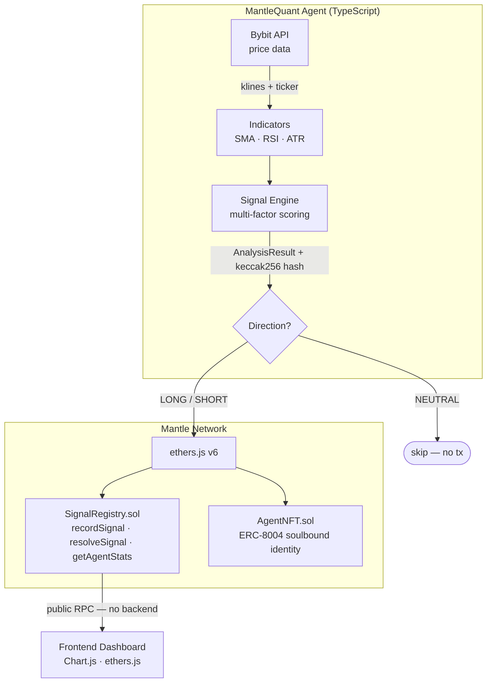

# MantleQuant

**Verifiable AI Trading Signals on Mantle Network**

> Every AI signal decision is written to the Mantle blockchain — immutable, public, and verifiable. No cherry-picking. No fake backtests. For the first time, AI trading performance can be benchmarked at scale on-chain.

Built for the **Turing Test Hackathon 2026** — AI Trading & Strategy track.

---

## The Problem

AI trading systems claim impressive backtest numbers, but those numbers are privately computed and impossible to verify. Any system can cherry-pick a good lookback window and present it as a "live track record." There is no way to know if the results were achieved in real-time or fabricated post-hoc.

## The Solution

MantleQuant publishes every signal **before** the outcome is known. A smart contract on Mantle Network records:

- The direction (LONG / SHORT / NEUTRAL)
- Confidence level (0–100%)
- Entry price at signal time
- Analysis hash (verifiable off-chain)
- Signal horizon (when to resolve)

After the horizon expires, the contract resolves the signal with the actual exit price and computes the return on-chain. The entire track record is immutable and auditable by anyone — no trust required.

---

## Architecture



---

## Smart Contracts

### SignalRegistry.sol

The core contract. Stores every AI signal immutably.

| Function | Description |
|----------|-------------|
| `recordSignal(asset, direction, confidence, entryPrice, horizon, analysisHash)` | Write a new signal — callable by the agent |
| `resolveSignal(id, exitPrice)` | Settle the signal after horizon elapses |
| `getAgentStats(address)` | On-chain accuracy + P&L for any agent |
| `getSignals(from, count)` | Paginated batch read for frontends |

**Signal struct:**
```solidity
struct Signal {
    uint256  id;
    address  agent;
    string   asset;           // "BTC", "ETH", "MNT"
    Direction direction;      // LONG / SHORT / NEUTRAL
    uint16   confidence;      // 0–1000 (0.0%–100.0%)
    uint128  entryPrice;      // price × 1e8
    uint32   horizon;         // minutes
    uint48   timestamp;
    bytes32  analysisHash;    // keccak256 of off-chain analysis
    uint128  exitPrice;       // filled on resolution
    bool     resolved;
    int64    returnBps;       // actual return in basis points
}
```

### AgentNFT.sol

Soulbound ERC-721 identity NFT for agents (ERC-8004 inspired).

- One NFT per agent address — cannot be transferred
- On-chain metadata (no external server)
- Accumulates reputation via SignalRegistry stats

---

## Signal Generation Engine

Five independent factors combine into a calibrated composite score:

| Factor | Weight | Logic |
|--------|--------|-------|
| Trend | ~35% | SMA20 vs SMA50 crossover |
| Momentum | ~25% | RSI14 mean-reversion |
| Price change | ~15% | 24h momentum confirmation |
| Volatility adj | ~15% | ATR-based confidence penalty |
| Dead-band filter | — | ±0.25 threshold → NEUTRAL |

Output: `Direction ∈ {LONG, SHORT, NEUTRAL}` + `confidence ∈ [0, 950]`

---

## Covered Assets

| Asset | Source | Symbol |
|-------|--------|--------|
| Bitcoin | Bybit Perpetuals | BTCUSDT |
| Ethereum | Bybit Perpetuals | ETHUSDT |
| **Mantle** | Bybit Perpetuals | **MNTUSDT** |

MNT (Mantle's native token) is included as the flagship asset to maximise Mantle ecosystem alignment.

---

## Quick Start

### Prerequisites

- Node.js ≥ 20
- A Mantle Sepolia testnet wallet with MNT for gas ([faucet](https://faucet.sepolia.mantle.xyz))

### 1. Install

```bash
git clone https://github.com/ryonzhang/mantle-quant
cd mantle-quant
npm install
```

### Deployed Contracts (Mantle Sepolia Testnet)

| Contract | Address |
|----------|---------|
| SignalRegistry | [`0x4E099F820985158C1732ad0d4b98EEcBc83D9feb`](https://explorer.sepolia.mantle.xyz/address/0x4E099F820985158C1732ad0d4b98EEcBc83D9feb) |
| AgentNFT | [`0x7d8c78ABb9FDbb76aCEbeB753455CC7c12FA93F4`](https://explorer.sepolia.mantle.xyz/address/0x7d8c78ABb9FDbb76aCEbeB753455CC7c12FA93F4) |

Both contracts verified on [Sourcify](https://repo.sourcify.dev/contracts/full_match/5003/0x4E099F820985158C1732ad0d4b98EEcBc83D9feb/).

---

### 2. Demo (no wallet needed)

```bash
npm run demo
# Fetches live data from Bybit API and runs analysis in dry-run mode
```

### 3. Deploy to Mantle Testnet

```bash
cp .env.example .env
# Fill in your PRIVATE_KEY

npm run compile
npm run deploy:testnet
# Saves addresses to deployed-addresses.json
```

### 4. Update .env

```bash
# Set the addresses from deployed-addresses.json
SIGNAL_REGISTRY_ADDRESS=0x...
AGENT_NFT_ADDRESS=0x...
```

### 5. Run the Agent

```bash
npm run agent
# Analyzes BTC/ETH/MNT every hour
# Writes non-NEUTRAL signals to Mantle chain
# Resolves expired signals automatically
```

### 6. View Dashboard

Open `frontend/index.html` in a browser, paste the SignalRegistry address, and click Load.

Or deploy to GitHub Pages for a public URL.

---

## Testing

```bash
# Compile contracts
npm run compile

# Run Hardhat tests (14 tests across SignalRegistry + AgentNFT)
npm run test:contracts

# TypeScript typecheck
npm run typecheck
```

---

## Judging Criteria Alignment

| Criterion | Implementation |
|-----------|---------------|
| **Technical Depth** (30%) | Solidity contracts with full event logging + resolution logic; multi-factor quant engine; ethers.js v6 integration; on-chain P&L computation |
| **Innovation** (25%) | First verifiable AI trading benchmark on Mantle — signals are on-chain axioms, not cherry-picked claims; ERC-8004 soulbound agent identity |
| **Mantle Ecosystem** (25%) | Deployed on Mantle Sepolia/Mainnet; covers MNT native token; integrates with Mantle Explorer; ERC-8004 agent identity standard |
| **Product Completeness** (20%) | Working CLI demo (`npm run demo`); live dashboard reading from chain; Hardhat tests; full README; one-command deploy |

---

## Track

**AI Trading & Strategy** (Sponsored by Bybit and Blockchain for Good Alliance)

- Bybit API: price data + klines for all analysis
- Python/Solidity templates: replaced with TypeScript + Solidity (superior type safety)
- On-chain execution: every signal recorded on Mantle at signal-time, resolved with actual prices

---

## License

MIT

---

## Built By

Ruiyang Zhang — [ruiyang.co](https://ruiyang.co) | [@ryonzhang](https://github.com/ryonzhang)

Background in quantitative finance (passed all three CFA Program exams, FRM Level 1) and agentic AI systems.
