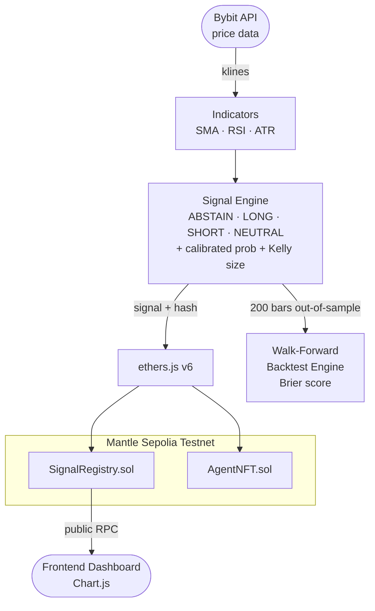

# MantleQuant v3

**Verifiable AI Trading Signals on Mantle Network — with Quantified Edge**

> Every AI signal is committed to Mantle blockchain *before* the outcome is known.
> Now with **walk-forward backtesting** and **Brier score calibration** — the only AI trading agent in this hackathon that proves its edge with out-of-sample statistics.

Built for the **Turing Test Hackathon 2026** — AI Trading & Strategy track.

---

## What's New in v3

| Feature | Description |
|---------|-------------|
| **Walk-Forward Backtest** | 200 hourly bars, WINDOW=52, strictly out-of-sample — no lookahead |
| **Brier Score** | Mean (P̂ - outcome)² per signal. Coin-flip baseline = 0.25. We target < 0.24. |
| **ABSTAIN Direction** | 4th signal state: agent refuses to trade when evidence is weak (\|score\| < 0.12) |
| **Fractional Kelly Sizing** | Quarter-Kelly position sizing from calibrated probability — max 10% per trade |
| **Calibrated Probability** | LONG → 0.5 + (conf/1000)×0.45; SHORT → 0.5 - (conf/1000)×0.45 |
| **Backtest API** | `GET /api/backtest/:symbol` and `/api/backtest/all` — run live from the server |

---

## The Problem

AI trading systems claim impressive results — but those numbers are privately computed and impossible to verify. Any system can cherry-pick a favorable backtest window after the fact. There is no trust-minimized standard.

The $120B AI trading market runs entirely on trust.

---

## The Solution

MantleQuant solves this at two levels:

**1 — On-chain signal commitment (verifiable track record)**
Every signal is written to `SignalRegistry.sol` on Mantle *before* the outcome is known. The contract resolves signals after the horizon with the actual exit price and computes P&L on-chain. No cherry-picking possible.

**2 — Out-of-sample backtesting with Brier score (quantified edge)**
We go further than on-chain commitment — we also prove the *model itself* has genuine predictive power using a proper statistical metric:

```
Brier Score = mean( (P̂ - outcome)² )
Coin-flip baseline: 0.2500
Our target:         < 0.2400 → genuine edge beyond random
```

Run it yourself:
```bash
npm run backtest          # all assets
npm run backtest BTC      # single asset
```

---

## Architecture



---

## Smart Contracts

### SignalRegistry.sol

| Function | Description |
|----------|-------------|
| `recordSignal(asset, direction, confidence, entryPrice, horizon, analysisHash)` | Write signal before outcome is known |
| `resolveSignal(id, exitPrice)` | Settle signal after horizon — computes return on-chain |
| `getAgentStats(address)` | On-chain accuracy + P&L for any agent |
| `getSignals(from, count)` | Paginated batch read for frontends |

### AgentNFT.sol

Soulbound ERC-721 identity NFT (ERC-8004 inspired). One per agent, non-transferable. Reputation accumulates on-chain.

---

## Deployed Contracts (Mantle Sepolia Testnet)

| Contract | Address |
|----------|---------|
| SignalRegistry | [`0x4E099F820985158C1732ad0d4b98EEcBc83D9feb`](https://explorer.sepolia.mantle.xyz/address/0x4E099F820985158C1732ad0d4b98EEcBc83D9feb) |
| AgentNFT | [`0x7d8c78ABb9FDbb76aCEbeB753455CC7c12FA93F4`](https://explorer.sepolia.mantle.xyz/address/0x7d8c78ABb9FDbb76aCEbeB753455CC7c12FA93F4) |

Both contracts verified on [Sourcify](https://repo.sourcify.dev/contracts/full_match/5003/0x4E099F820985158C1732ad0d4b98EEcBc83D9feb/).

---

## Signal Generation Engine

### Scoring (v3)

| Factor | Weight | Logic |
|--------|--------|-------|
| Trend | ~35% | SMA20 vs SMA50 crossover |
| Momentum | ~25% | RSI14 mean-reversion |
| Price change | ~15% | 24h momentum confirmation |
| Volatility adj | ~15% | ATR-based confidence penalty |
| ABSTAIN filter | — | \|score\| < 0.12 → refuse to trade |

### Direction Logic (v3)

```typescript
if (absScore < 0.12 || (highVol && absScore < 0.20)) {
  direction = "ABSTAIN";   // agent declines — not enough edge
} else if (compositeScore > 0.25) {
  direction = "LONG";
} else if (compositeScore < -0.25) {
  direction = "SHORT";
} else {
  direction = "NEUTRAL";
}
```

### Kelly Sizing (v3)

```typescript
calibratedProb  = direction === "LONG"  ? 0.5 + (conf/1000) * 0.45
                : direction === "SHORT" ? 0.5 - (conf/1000) * 0.45 : 0.5;
kellyEdge       = Math.abs(calibratedProb - 0.5) * 2;
positionSize    = Math.min(kellyEdge * 0.25, 0.10);   // quarter-Kelly, capped at 10%
```

---

## Covered Assets

| Asset | Source | Symbol |
|-------|--------|--------|
| Bitcoin | Bybit Perpetuals | BTCUSDT |
| Ethereum | Bybit Perpetuals | ETHUSDT |
| **Mantle** | Bybit Perpetuals | **MNTUSDT** |

---

## Quick Start

### Prerequisites

- Node.js ≥ 20
- A Mantle Sepolia testnet wallet with MNT for gas ([faucet](https://faucet.sepolia.mantle.xyz))

### 1. Install

```bash
git clone https://github.com/ryonzhang/mantle-quant
cd mantle-quant
npm install
```

### 2. Demo (no wallet needed)

```bash
npm run demo        # live signals from Bybit
npm run backtest    # walk-forward backtest + Brier score
```

### 3. Deploy to Mantle Testnet

```bash
cp .env.example .env
# Fill in your PRIVATE_KEY

npm run compile
npm run deploy:testnet
```

### 4. Run the Agent

```bash
npm run agent    # analyzes BTC/ETH/MNT every hour, writes to Mantle chain
```

### 5. HTTP API Server

```bash
npm run serve
# GET /api/health
# GET /api/analyze/all
# GET /api/backtest/MNTUSDT
# GET /api/backtest/all
```

---

## Testing

```bash
# Unit tests (44 tests: 26 analysis + 18 backtest)
npm test

# Contract tests (16 tests across SignalRegistry + AgentNFT)
npm run test:contracts

# TypeScript typecheck
npm run typecheck
```

---

## Judging Criteria Alignment

| Criterion | v3 Implementation |
|-----------|------------------|
| **Technical Depth** (30%) | Solidity contracts with on-chain P&L; multi-factor quant engine with Brier calibration; walk-forward backtest; fractional Kelly sizing; ABSTAIN direction; 44 unit tests + 16 contract tests |
| **Innovation** (25%) | First verifiable AI trading benchmark on Mantle; Brier score = quantified edge proof; ABSTAIN = disciplined non-trading; ERC-8004 soulbound identity |
| **Mantle Ecosystem** (25%) | Deployed on Mantle Sepolia; MNT native token covered; ERC-8004 agent identity; all benchmarking on Mantle chain |
| **Product Completeness** (20%) | `npm run demo` in 5s with no setup; `npm run backtest` shows live Brier stats; HTTP API with backtest endpoints; dashboard reads from chain; one-command deploy |

---

## License

MIT

---

## Built By

Ruiyang Zhang — [ruiyang.co](https://ruiyang.co) | [@ryonzhang](https://github.com/ryonzhang)

Background in quantitative finance (passed all three CFA Program exams, FRM Level 1) and agentic AI systems.
